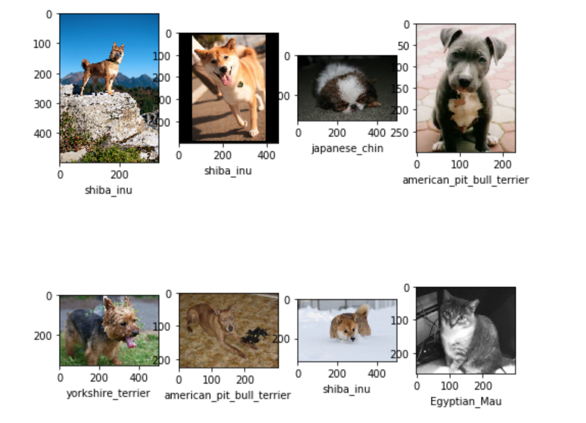

# Machine-Learning-with-AWS

The present project consists of several computer vision algorithms on AWS. Specifically, I work with the popular Oxford IIIT Pet Dataset and and use Amazon SageMaker to create, train and deploy an image classifier, an image classifier with TensorFlow, an Object Detection and a Semantic Segmentation model.

More detail on each algorithm is discussed below.

#1. Classification with AWS SageMaker. [Code](https://github.com/FarruhShahidi/Machine-Learning-with-AWS/blob/master/sage-classification.ipynb).

This part I classify classify 37 breeds of dogs and cats from the dataset mentioned above. Here are some images

# 2. Tensorflow with Amazon Sagemaker. 

In this part,   train and deploy an image classifier created and trained with the TensorFlow framework within the Amazon Sagemaker ecosystem. Sagemaker provides a number of machine learning algorithms ready to be used for solving a number of tasks. However, it is possible to use Sagemaker for custom training scripts as well. I will use TensorFlow and Sagemaker's TensorFlow Estimator to create, train and deploy a model that will be able to classify images of dogs and cats from the popular Oxford IIIT Pet Dataset.

The classification uses mobilenetV2 architechture developed by Google. For more info about mobilenet click on [this](<https://towardsdatascience.com/review-mobilenetv2-light-weight-model-image-classification-8febb490e61c>). To read the paper click on [this](<https://arxiv.org/abs/1801.04381>).