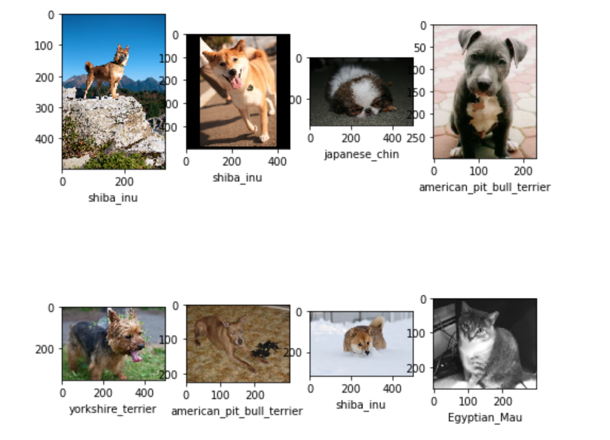
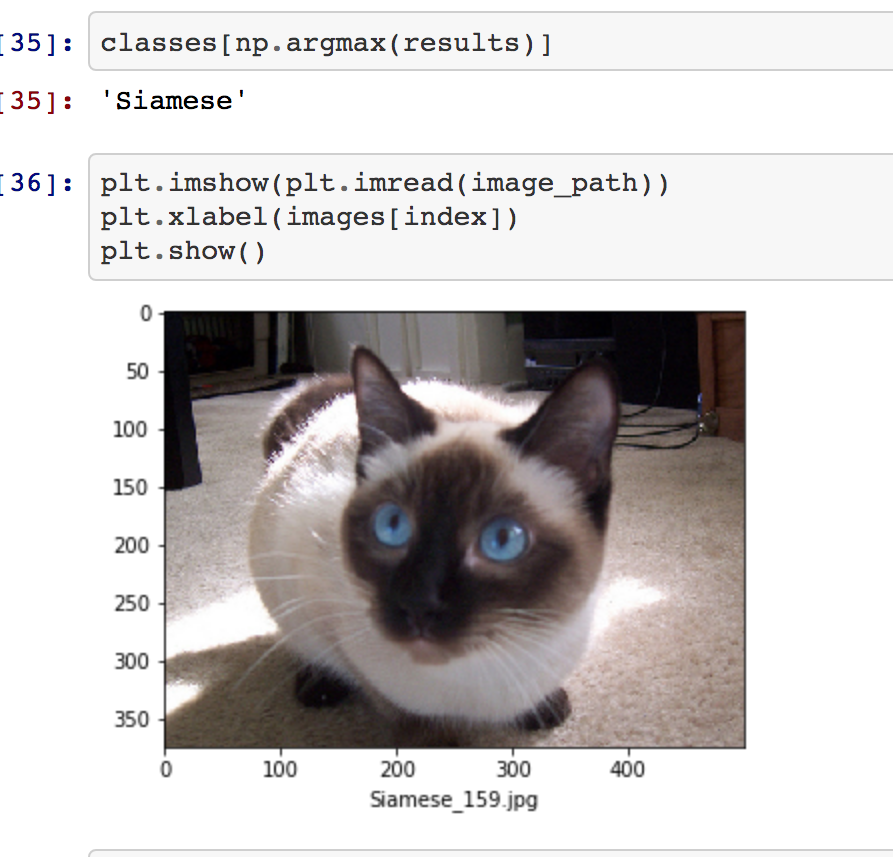
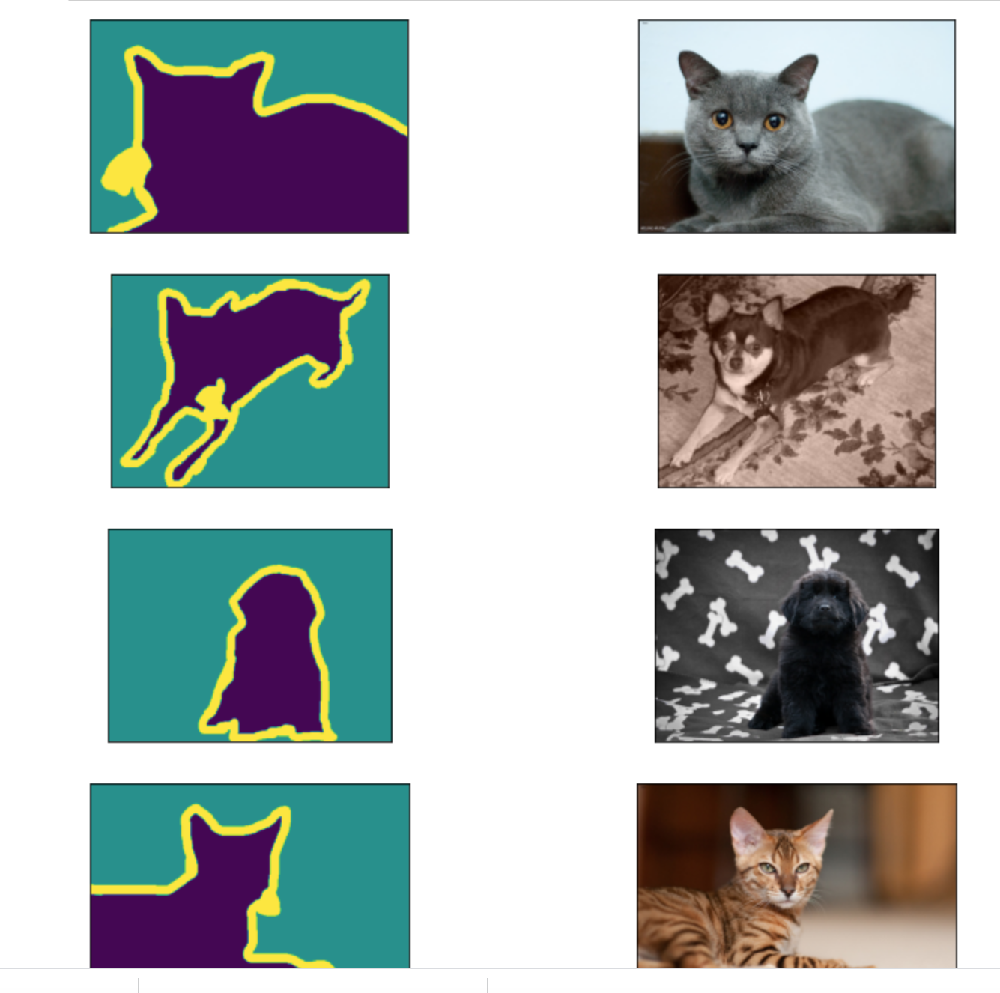
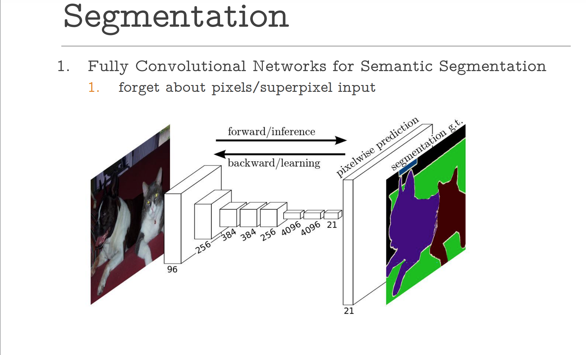
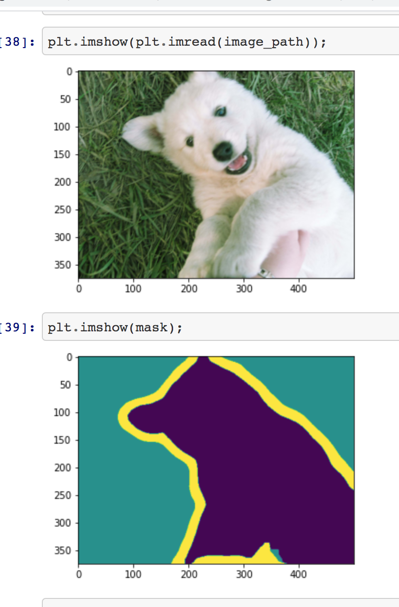
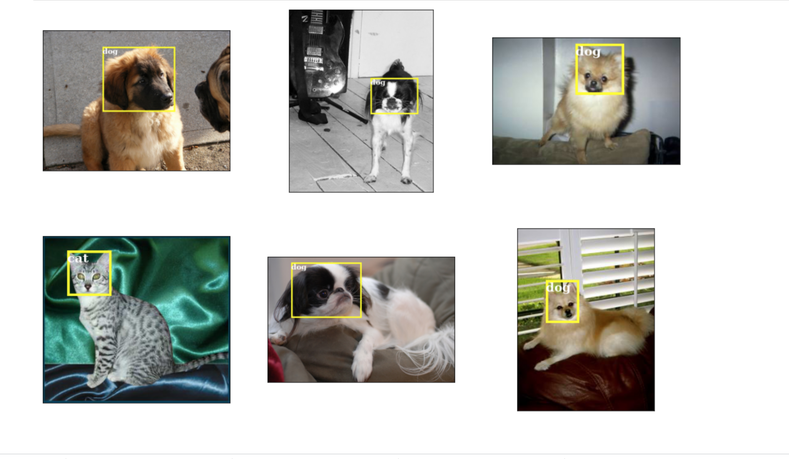
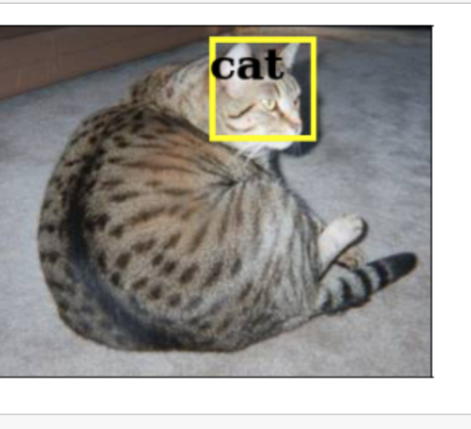

# Machine-Learning-with-AWS

The present project consists of several computer vision algorithms on AWS. Specifically, I work with the popular Oxford IIIT Pet Dataset and and use Amazon SageMaker to create, train and deploy the following models:
1. An Image classifier with Amazon SageMaker.

2. An image classifier with TensorFlow within SageMaker ecosystem.

 3. An Object Detection.
 
 4.  A Semantic Segmentation.

More detail on each algorithm is discussed below.

# 1. Classification with AWS SageMaker. [Notebook](https://github.com/FarruhShahidi/Machine-Learning-with-AWS/blob/master/sage-classification.ipynb)

This part I classify classify 37 breeds of dogs and cats from the dataset mentioned above. Here are some images.

The model uses a pre-trained [ResNet-50](https://keras.io/api/applications/resnet/#resnet50-function) to train. Here is the prediction example:

# 2. Semantic Segmentation.  [Notebook](https://github.com/FarruhShahidi/Machine-Learning-with-AWS/blob/master/Semantic-segmentation.ipynb)
This part uses the semantic segmentation algorithm from SageMaker to create, train and deploy a model  segments images of dogs and cats f into 3 unique pixel values. That is, each pixel of an input image would be classified as either foreground (pet), background (not a pet), or unclassified (transition between foreground and background). Along with the dataset we also use the trimap segmentation images for training.

The SageMaker semantic segmentation algorithm provides you with a choice of three build-in algorithms to train a deep neural network. You can use the Fully-Convolutional Network (FCN) algorithm , Pyramid Scene Parsing (PSP) algorithm, or DeepLabV3. I use the former algorithm which you can read about it [here](https://arxiv.org/pdf/1605.06211.pdf).  Here is the architecture in a picture.

By training and deploying the dataset using the above algorithm I got the prediction as follows.

# 3. Object Detection. [Notebook](https://github.com/FarruhShahidi/Machine-Learning-with-AWS/blob/master/object-detection.ipynb)

In this part, I use the SSD Object Detection algorithm from SageMaker to create, train and deploy a model that localizes the images from the dataset. For the training part the localized images should also be included. Take a look at some random localized images.

After training and deployment one can see the prediction:

# 4. TensorFlow with Amazon SageMaker. [Notebook](https://github.com/FarruhShahidi/Machine-Learning-with-AWS/blob/master/Tensorflow-in-Sagemaker.ipynb )

In this part,  I  train and deploy an image classifier created and trained with the TensorFlow framework within the Amazon SageMaker ecosystem. SageMaker provides a number of machine learning algorithms ready to be used for solving a number of tasks. However, it is possible to use SageMaker for custom training scripts as well. I will use TensorFlow and SageMaker's TensorFlow Estimator to create, train and deploy a model that will be able to classify images of dogs and cats.

The classification uses mobilenetV2 architecture developed by Google. While other architecture lead to better accuracy, the one that I used took less time training.  For more info about mobilenet click on [this](<https://towardsdatascience.com/review-mobilenetv2-light-weight-model-image-classification-8febb490e61c>). To read the paper click on [this](<https://arxiv.org/abs/1801.04381>).

References.

1. https://www.coursera.org/instructor/amityadav
2. https://docs.aws.amazon.com/sagemaker/index.html
3. https://arxiv.org/abs/1512.02325
4. https://arxiv.org/abs/1605.06211
5. https://arxiv.org/abs/1801.04381

